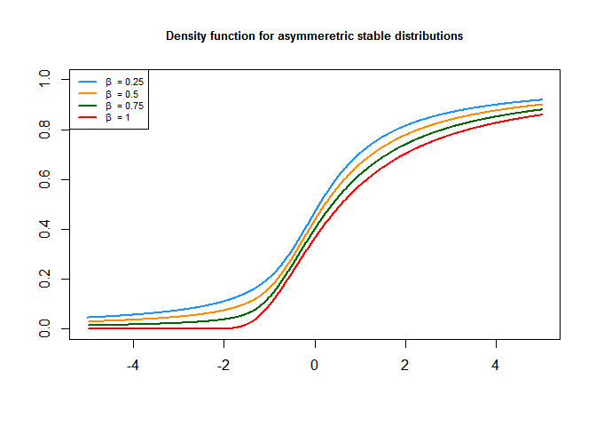
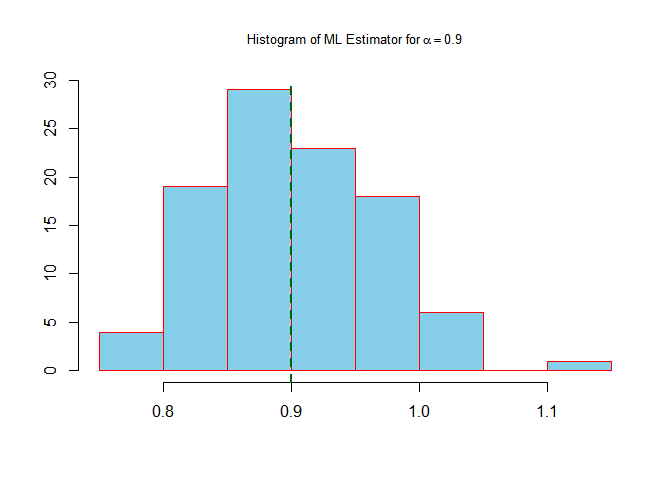
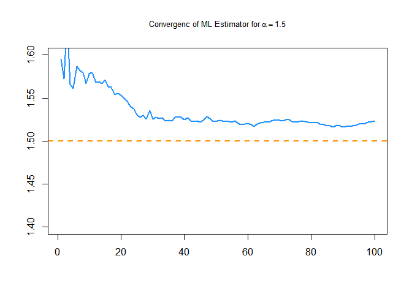
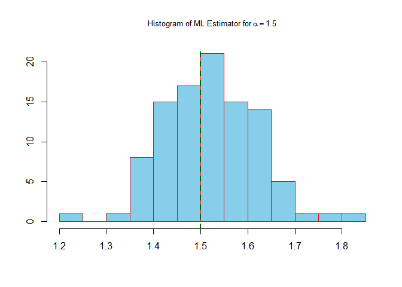

Alpha-Stable distributions (Simulation and Estimation)
================
Mohamad Fasih
2024-02-18

## Libraries

``` r
library(stabledist)
library(knitr)
```

## Probability density function for symmetric case

``` r
set.seed(123)
x <- seq(-5, 5, by = 0.01)
plot(x, dstable(x, 0.6, 0, 1, 0), type = "l", lwd = 2, col = "dodgerblue", 
xlab = "", ylab = "", main = "Density function for symmeretric stable distributions", 
cex.main = 0.8)
lines(x, dstable(x, 0.9, 0, 1, 0), type = "l", lwd = 2, col = "darkorange")
lines(x, dstable(x, 1.2, 0, 1, 0), type = "l", lwd = 2, col = "darkgreen")
lines(x, dstable(x, 1.5, 0, 1, 0), type = "l", lwd = 2, col = "gold")
lines(x, dstable(x, 1.8, 0, 1, 0), type = "l", lwd = 2, col = "red")
legend("topright", legend = c(expression(alpha~ " = 0.6"), 
expression(alpha~ " = 0.9"), expression(alpha~ " = 1.2"),
expression(alpha~ " = 1.5"), expression(alpha~ " = 1.8")), 
col = c("dodgerblue", "darkorange", "darkgreen", "gold", "red"), lwd = 2, 
cex = 0.7)
```

<!-- -->

## Cumulative distribution function for symmetric case

``` r
plot(x, pstable(x, 0.6, 0, 1, 0), type = "l", lwd = 2, col = "dodgerblue", ylim = c(0, 1), 
, xlab = "", ylab = "", main = "Distribution function for symmeretric stable distributions", 
cex.main = 0.8)
lines(x, pstable(x, 0.9, 0, 1, 0), type = "l", lwd = 2, col = "darkorange")
lines(x, pstable(x, 1.2, 0, 1, 0), type = "l", lwd = 2, col = "darkgreen")
lines(x, pstable(x, 1.5, 0, 1, 0), type = "l", lwd = 2, col = "gold")
lines(x, pstable(x, 1.8, 0, 1, 0), type = "l", lwd = 2, col = "red")
legend("topleft", legend = c(expression(alpha~ " = 0.6"), 
expression(alpha~ " = 0.9"), expression(alpha~ " = 1.2"),
expression(alpha~ " = 1.5"), expression(alpha~ " = 1.8")), 
col = c("dodgerblue", "darkorange", "darkgreen", "gold", "red"), lwd = 2, 
cex = 0.7)
```

<!-- -->

## Probability density function for asymmetric case

``` r
plot(x, dstable(x, 1, 0.25, 1, 0), type = "l", lwd = 2, col = "dodgerblue", 
, xlab = "", ylab = "", main = "Density function for asymmeretric stable distributions",
cex.main = 0.8)
lines(x, dstable(x, 1, 0.5, 1, 0), type = "l", lwd = 2, col = "darkorange")
lines(x, dstable(x, 1, 0.75, 1, 0), type = "l", lwd = 2, col = "darkgreen")
lines(x, dstable(x, 1, 1, 1, 0), type = "l", lwd = 2, col = "red")
legend("topright", legend = c(expression(beta~ " = 0.25"), 
expression(beta~ " = 0.5"), expression(beta~ " = 0.75"),
expression(beta~ " = 1")), 
col = c("dodgerblue", "darkorange", "darkgreen", "red"), lwd = 2, 
cex = 0.7)
```

<!-- -->

## Cumulative distribution function for asymmetric case

``` r
plot(x, pstable(x, 1, 0.25, 1, 0), type = "l", lwd = 2, col = "dodgerblue", ylim = c(0, 1), 
, xlab = "", ylab = "", main = "Density function for asymmeretric stable distributions", 
cex.main = 0.8)
lines(x, pstable(x, 1, 0.5, 1, 0), type = "l", lwd = 2, col = "darkorange")
lines(x, pstable(x, 1, 0.75, 1, 0), type = "l", lwd = 2, col = "darkgreen")
lines(x, pstable(x, 1, 1, 1, 0), type = "l", lwd = 2, col = "red")
legend("topleft", legend = c(expression(beta~ " = 0.25"), 
expression(beta~ " = 0.5"), expression(beta~ " = 0.75"),
expression(beta~ " = 1")), 
col = c("dodgerblue", "darkorange", "darkgreen", "red"), lwd = 2, 
cex = 0.7)
```

<!-- -->

## Checking tail probabilities for symmetric case

``` r
p <- c(2, 5, 10, 20)
p1 <- pstable(p, 0.6, 0, 1, 0, lower.tail = FALSE)
p2 <- pstable(p, 0.9, 0, 1, 0, lower.tail = FALSE)
p3 <- pstable(p, 1.2, 0, 1, 0, lower.tail = FALSE)
p4 <- pstable(p, 1.5, 0, 1, 0, lower.tail = FALSE)
p5 <- pstable(p, 1.8, 0, 1, 0, lower.tail = FALSE)
df <- data.frame(p = p, p1, p2, p3, p4, p5)
colnames(df) <- c("p", "alpha=0.6", "alpha=0.9", "alpha=1.2", "alpha=1.5",
 "alpha=1.8")
kable(df, "pipe", align = c("l", "c", "c"))
```

| p   | alpha=0.6 | alpha=0.9 | alpha=1.2 | alpha=1.5 | alpha=1.8 |
|:----|:---------:|:---------:|:----------|:---------:|:---------:|
| 2   | 0.1981578 | 0.1586026 | 0.1282269 | 0.1050393 | 0.0877029 |
| 5   | 0.1268689 | 0.0755530 | 0.0422849 | 0.0206686 | 0.0066480 |
| 10  | 0.0878358 | 0.0414320 | 0.0179674 | 0.0066393 | 0.0015474 |
| 20  | 0.0598129 | 0.0224355 | 0.0077185 | 0.0022701 | 0.0004239 |

## Checking tail probabilities for asymmetric case

``` r
p <- c(2, 5, 10, 20)
p1 <- pstable(p, 0.6, 0.8, 1, 0, lower.tail = FALSE)
p2 <- pstable(p, 0.9, 0.8, 1, 0, lower.tail = FALSE)
p3 <- pstable(p, 1.2, 0.8, 1, 0, lower.tail = FALSE)
p4 <- pstable(p, 1.5, 0.8, 1, 0, lower.tail = FALSE)
p5 <- pstable(p, 1.8, 0.8, 1, 0, lower.tail = FALSE)

df <- data.frame(p = p, p1, p2, p3, p4, p5)
colnames(df) <- c("p", "alpha=0.6", "alpha=0.9", "alpha=1.2", "alpha=1.5",
 "alpha=1.8")
kable(df, "pipe", align = c("l", "c", "c"))
```

| p   | alpha=0.6 | alpha=0.9 | alpha=1.2 | alpha=1.5 | alpha=1.8 |
|:----|:---------:|:---------:|:----------|:---------:|:---------:|
| 2   | 0.3629263 | 0.2879839 | 0.2245698 | 0.1682557 | 0.1149300 |
| 5   | 0.2421764 | 0.1484117 | 0.0845200 | 0.0413327 | 0.0128282 |
| 10  | 0.1681291 | 0.0811727 | 0.0354640 | 0.0129550 | 0.0029110 |
| 20  | 0.1135130 | 0.0430539 | 0.0147659 | 0.0042814 | 0.0007806 |

## checking the infinity variance

``` r
n1 <- 50
n2 <- 100
n3 <- 200
n4 <- 500
s1 <- rstable(n1, 1, 0, 1, 0)
s2 <- rstable(n2, 1, 0, 1, 0)
s3 <- rstable(n3, 1, 0, 1, 0)
s4 <- rstable(n4, 1, 0, 1, 0)

par(mfrow = c(2, 2))
plot(cumsum(s1 ^ 2) / (1:length(s1)), type = "l", col = "dodgerblue", 
lwd = 2, xlab = "", ylab = "", main = "Sample Variance with Increasing sample Size to 50", 
cex.main = 0.7)

plot(cumsum(s2 ^ 2) / (1:length(s2)), type = "l", col = "dodgerblue", 
lwd = 2, xlab = "", ylab = "", main = "Sample Variance with Increasing sample Size to 100", 
cex.main = 0.7)

plot(cumsum(s3 ^ 2) / (1:length(s3)), type = "l", col = "dodgerblue", 
lwd = 2, xlab = "", ylab = "", main = "Sample Variance with Increasing sample Size to 200", 
cex.main = 0.7)

plot(cumsum(s4 ^ 2) / (1:length(s4)), type = "l", col = "dodgerblue", 
lwd = 2, xlab = "", ylab = "", main = "Sample Variance with Increasing sample Size to 500", 
cex.main = 0.7)
```

<!-- -->

## Maximum likelihood estimation for alpha (alpha = 0.9)

``` r
n <- 250
r <- 100
alpha1 <- 0.9
beta <- 0
gamma <- 1
mu <- 0
s <- matrix(rep(NA, n * r), r, n)
for(i in 1:r)
s[i, ] <- rstable(n, alpha1, beta, gamma, mu)
alpha_hat_1 <- NULL


for(i in 1:r)
alpha_hat_1[i] <- as.numeric(unlist(optim(0.5, function(par){
ifelse(par<0.1 | par>2, -10000, sum(log(dstable(s[i, ], par, 0, 1, 0))))},
control = list(fnscale = -1))))[1]


c(mean(alpha_hat_1), sd(alpha_hat_1))
```

    ## [1] 0.90486914 0.06121775

``` r
plot(cumsum(alpha_hat_1) / (1:length(alpha_hat_1)), type = "l", 
col = "dodgerblue", lwd = 2, ylim = c(0.8, 1), ylab = "")
abline(h = alpha1, col = "darkorange", lwd = 2, lty = 2, xlab = "", ylab = "", main = bquote("Convergenc of ML Estimator for"~alpha == 0.9), 
cex.main = 0.8)
```

<!-- -->

``` r
hist(alpha_hat_1, col = "skyblue", border = "red", xlab = "", ylab = "", 
main = bquote("Histogram of ML Estimator for"~alpha == 0.9), 
cex.main = 0.8)
abline(v = alpha1, col = "darkgreen", lwd = 2, lty = 2)
```

<!-- -->

## Maximum likelihood estimation for alpha (alpha = 1.5)

``` r
alpha2 <- 1.5
s <- matrix(rep(NA, n * r), r, n)
for(i in 1:r)
s[i, ] <- rstable(n, alpha2, beta, gamma, mu)
alpha_hat_2 <- NULL


for(i in 1:r)
alpha_hat_2[i] <- as.numeric(unlist(optim(1, function(par){
ifelse(par<0.1 | par>2, -10000, sum(log(dstable(s[i, ], par, 0, 1, 0))))},
control = list(fnscale = -1))))[1]


c(mean(alpha_hat_2), sd(alpha_hat_2))
```

    ## [1] 1.5139453 0.1011094

``` r
plot(cumsum(alpha_hat_2) / (1:length(alpha_hat_2)), type = "l", 
col = "dodgerblue", lwd = 2, xlab = "", ylab = "", main = bquote("Convergenc of ML Estimator for"~alpha == 1.5), 
cex.main = 0.8)
abline(h = alpha2, col = "darkorange", lwd = 2, lty = 2)
```

<!-- -->

``` r
hist(alpha_hat_2, col = "skyblue", border = "red", xlab = "", ylab = "", 
main = bquote("Histogram of ML Estimator for"~alpha == 1.5), 
cex.main = 0.8)
abline(v = alpha2, col = "darkgreen", lwd = 2, lty = 2)
```

<!-- -->
